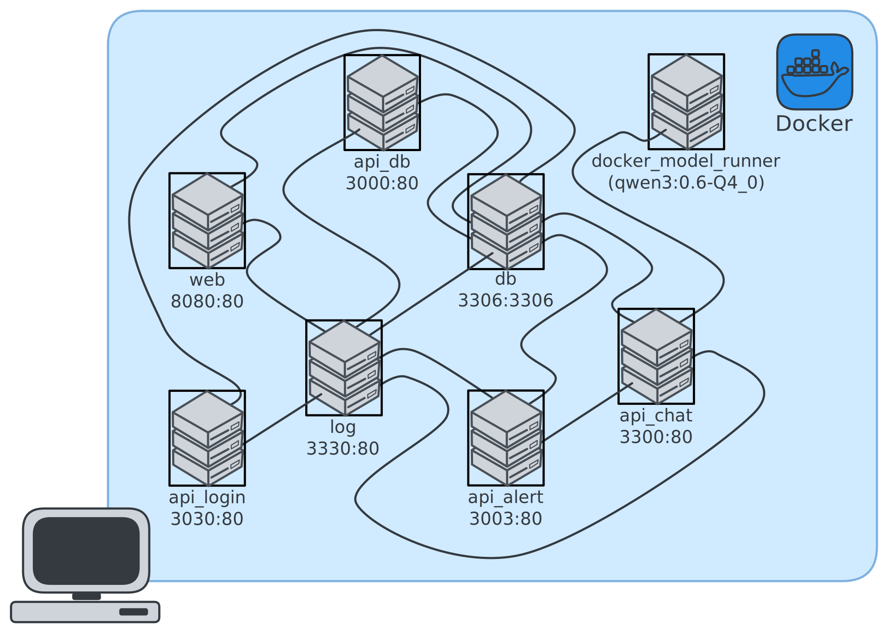

# Sistema de soporte para Vulnerabilidades y Amenazas basado en Inteligencia Artificial (SVAIA)

Proyecto CyberMind: SVAIA - SmartTrack



## Aplicación Web de SVAIA

La aplicación web de **SVAIA** ha sido desarrollada siguiendo una arquitectura basada en microservicios haciendo uso de API REST.

El desarrollo forma parte de un proyecto de ingeniería del software seguro, realizado mediante la aplicación de metodologías ágiles.

Para ello se ha empleado **Docker** como plataforma de contenerización para facilitar el despliegue y configuración.

## Funcionalidades

La aplicación web ofrece un gran número de funcionalidades acordes a la especificación del proyecto:

- Consultar la base de datos de CVE incluida en el proyecto

> [!NOTE]
> Se incluye un subconjunto de registros de prueba para realizar una DEMO

- Crear, Modificar y Eliminar **usuarios** y **proyectos**

> [!TIP]
> Desde el panel de administración es posible visualizar usuarios deshabilitados y proyectos eliminados

- Subir ficheros de **SBOM** en formato **CycloneDX** y adjuntarlos a proyectos

> [!NOTE]
> El fichero `example_sbom.json` incluido permite probar esta funcionalidad
> [!TIP]
> Editar un proyecto para adjuntar un SBOM actualizado habilita la opción de regenerar un nuevo reporte

- Establecer parámetros de aceptabilidad para la generación de informes sobre los proyectos

- Generar y Visualizar **reportes** elaborados con inteligencia artificial, haciendo uso de un LLM ejecutado en local (no se comunica con APIs de terceros)

> [!WARNING]
> El tiempo de respuesta dependerá de las prestaciones del *hardware* donde se ejecute

- Administrar proyectos y usuarios desde un **panel de usuario** y un ***dashboard* de administrador**

- Realizar preguntas a la inteligencia artificial mediante un chat (por cuestiones de optimización y privacidad el chat es temporal y no se guardan conversaciones entre sesiones)

> [!IMPORTANT]
> El administrador puede consultar conversaciones anteriores desde la base de datos

- Recibir notificaciones en la aplicación web (accesibles en el icono del correo)

- Recibir una copia de los informes en el correo asociado a la cuenta (funcional si se crea un usuario con un correo electrónico válido)

> [!WARNING]
> Este servicio es funcional a nivel de DEMO mediante un *relay* de correo en un subdominio propio, cumpliendo con el RGPD.

La aplicación cuenta con una interfaz elegante basada en **Bootstrap Flatly** con una UI/UX intuitivas, además de un diseño responsivo que permite su uso en dispositivos móviles.

También se ha implementado un sistema de logging auditable y seguro, que permite registrar acciones de los usuarios y eventos relevantes en la aplicación mediante ***hash block-chaining***.

## Requisitos

- Sistema Operativo **Windows** o **macOS**
- Docker Desktop 4.42.1

> [!CAUTION]
> Es necesario tener Docker Model Runner habilitado para poder hacer uso de las funcionalidades de IA

## Instalación

Clonar este repositorio y desplazarse al directorio `code`

```bash
cd code
```

Iniciar la aplicación mediante `docker-compose`

```bash
docker compose up --build
```

Una vez lanzada, la aplicación es accesible desde el navegador en la URL [http://localhost:8080](http://localhost:8080)

Para parar la aplicación ejecutar

```bash
docker compose down
```

## Uso

Por defecto, la aplicación cuenta con un usuario administrador con las siguientes credenciales:

- **Usuario:** `admin`
- **Contraseña:** `admin_pass`

> [!TIP]
> Es posible cambiar la contraseña desde el panel de administración (recomendable).

El usuario administrador puede crear nuevos usuarios y proyectos, así como gestionar los existentes.

## DEMO

Puedes ver una demostración de la aplicación en el video `video_demo.mov` del repositorio.

## Autores

- Rafael Expósito Muñoz
- Alejandro Galán Rita
- Javier Martín Jurado
- Jesús Martínez Ortiz
